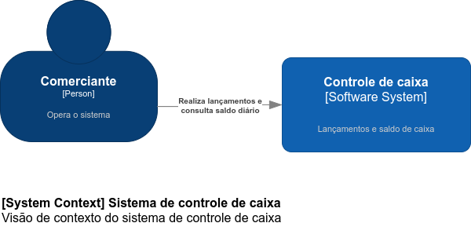
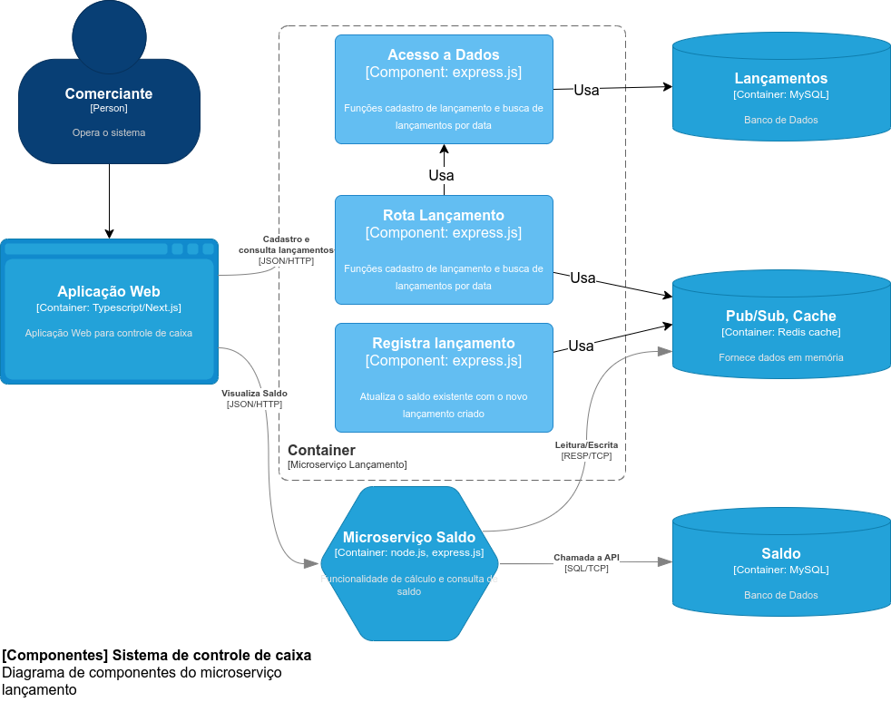

# Lançamento de caixa e saldo diário
Aplicação web para lançamentos de caixa e consulta de saldo do dia.

## Descritivo da Solução
Um comerciante precisa controlar o seu fluxo de caixa diário com os lançamentos (débitos e
créditos), também precisa de um relatório que disponibilize o saldo diário consolidado.

## Requisitos de negócio
Serviço que faça o controle de lançamentos
Serviço do consolidado diário

## Requisitos não funcionais
O serviço de controle de lançamento não deve ficar indisponível se o sistema de consolidado diário
cair.
Em dias de picos, o serviço de consolidado diário recebe 500 requisições por segundos, com no
máximo 5% de perda de requisições.

# Proposta de Solução

A proposta de solução envolve uma aplicação web para o cliente, onde fará o cadastro de lançamento e a visualização de saldo a partir de uma única tela.
A aplicação acessará dois microserviços. O microserviço lançamento será responsável por receber as solicitações de cadastro de novos lançamentos, e também irá fornecer a lista de lançamentos do dia solicitado. os dados serão gravados em um banco de dados relacional.
O microserviço saldo será responsável por calcular, gravar e fornecer o saldo do dia solicitado. Irá gravar os dados em um banco de dados relacional.

## Decisões de arquitetura

- para que o microserviço de lançamento não fique indisponível caso o microserviço de saldo caia, será usado o padrão publish/subscribe para que os dois serviços se comuniquem de forma independente.
- para atender a demanda de 500 requisições por segundo, o microserviço de saldo irá utilizar cache em memória, para evitar consulta em banco de dados. A aplicação web utilizará uma framework que disponibiliza o próprio mecanismo de cache, reutilizando a renderização do frontend. Os serviços utilizarão o pattern publish/subscribe para ficarem desacoplados e assim ficarem em funcionamento mesmo que um deles pare de funcionar.
- para garantir que haja no máximo 5% de perda de requisições, será implementada a observabilidade utilizando OpenTelemetry e a ferramenta New Relic, fazendo o monitoramento de recursos, performance e disponibilidade da infraestrutura e aplicações.

## Instalação

### Pré-requisitos

#### Docker Compose

Baixar e instalar o Docker Compose, a partir deste link: <https://docs.docker.com/compose/install/>

### Passo a passo

1. Criar um diretório (linux) ou pasta (Windows) e acessar

2. Clonar o repositório no GitHub:

`git clone https://github.com/andregati/caixa-diario.git`

3. Iniciar o Docker Compose:

`docker-compose up -d`

4. Acessar a URL da aplicação:
<http://localhost:3055/caixa>

## Documentação

### Banco de Dados

#### Schema: caixa
- Tabela: lancamentos
- Campos: id (bigint unsigned), data (date), descrição(varchar(50)), valor (decimal(11,2)), movimento char(1)

#### Schema: relatorio
- Tabela: saldo
- Campos: data (date), valor (decimal(15,2))

### Serviços

#### Lançamentos
	
##### Funcionalidades
- incluir: grava lançamento no BD, atualiza saldo no serviço Saldo
- consultar: lê lançamento do BD
	
#### Saldo

##### Funcionalidades
- incluir: grava saldo no BD
- consultar: lê saldo do BD

### Telas

##### Funcionalidades

1. Inclusão de movimentos
	- Informar a data do movimento
	- Informar a descrição do movimento
	- Informar o valor do movimento
	- Informar se o movimento é débito ou crédito
	- Gravar lançamento

2. Relatório de saldo diário
	- Informar a data desejada para visualizar saldo

